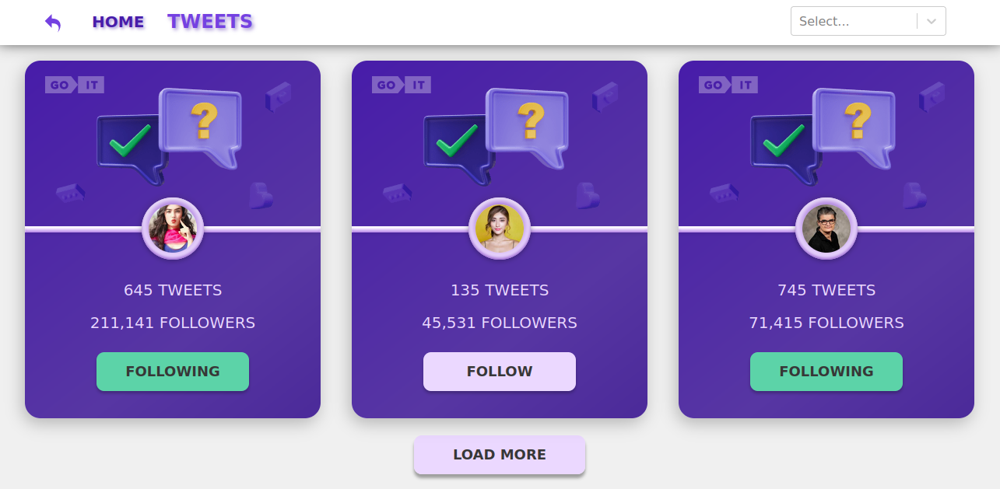

<h1 align="center">Tweets</h1>


## Description

Tweets are implemented using the development server Vite.js, which provides a highly efficient and fast development environment. It contains 2 pages - Home and Tweets. I've learned web development in GoIT for 3 month so don't expect too much from the source code but I put a lot of effort into implementing all the requirements of the technical specification.

**The project layout is located on Figma https://www.figma.com/file/zun1oP6NmS2Lmgbcj6e1IG/Test?node-id=0%3A1&t=VoiYTfiXggVItgVd-1**

## About the project

This is a simple app with tweets where you can follow or unfollow to them. Depending on the subscription status, the button changes color and text. The tweets can be sorted based on three criteria: all, following, and followed. Additionally, there is a "Load More" pagination feature that allows rendering three tweets per page. You can navigate back to the Home page using the back button or navigation.

## Tools

- This app is implemented in React.js and my personal backend for development was created using the UI service mockapi.io.
- The project utilizes the following libraries: axios for making HTTP requests, react-select for a customizable dropdown/select component, and react-loader-spinner to display loading spinners while waiting for asynchronous operations to complete.
- The routing is implemented using React Router, which indeed provides powerful navigation features such as links and the ability to navigate between routes programmatically.
- The "Go back" button is created using the useLocation hook provided by React Router. The useLocation hook allows to access the current location object, which contains information about the current URL.

### CSS

- All styles are implemented using CSS Modules, which allows applying styles to specific elements within the component without worrying about global naming conflicts.

## Project setup

```
npm install
npm run dev
```
